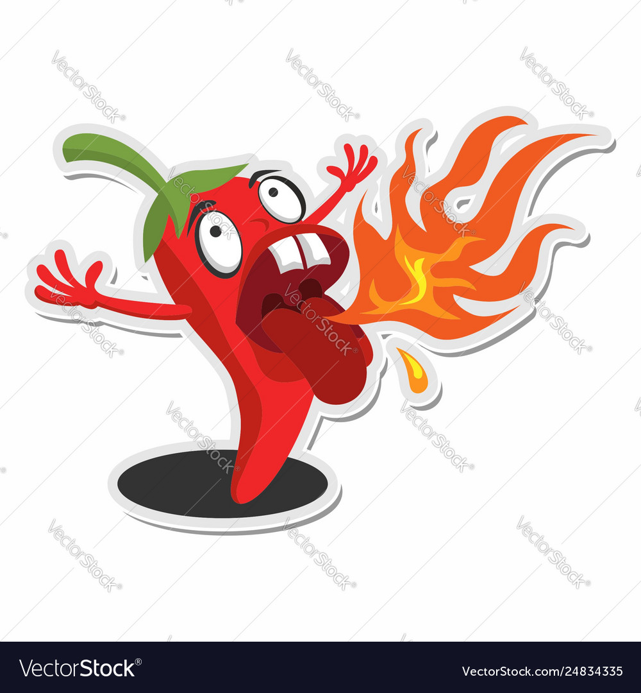
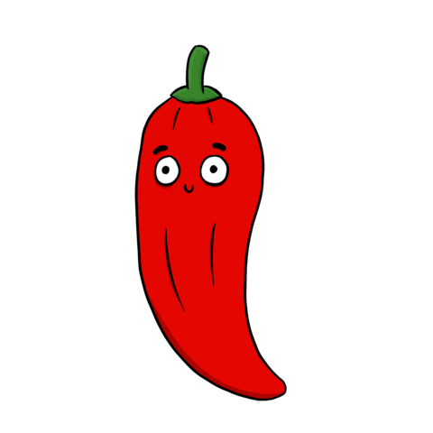

# Engineering_4_Notebook

&nbsp;

## Table of Contents
* [Raspberry_Pi_Assignment_Template](#raspberry_pi_assignment_template)
* [Onshape_Assignment_Template](#onshape_assignment_template)

&nbsp;

## Raspberry_Pi_Assignment_Template

### Assignment Description

Countdown from 10 to 0 and then saying liftoff, simulating a launch of a rocket here.

### Evidence 

### Wiring

No wiring was necessary for this part

### Code

### Reflection

What went wrong / was challenging, how'd you figure it out, and what did you learn from that experience? Your goal for the reflection is to pass on knowledge that will make this assignment better or easier for the next person. Think about your audience for this one, which may be "future you" (when you realize you need some of this code in three months), me, or your college admission committee!

&nbsp;

## Onshape_Assignment_Template

### Assignment Description

Write your assignment description here. What is the purpose of this assignment? It should be at least a few sentences.

### Part Link 

[Create a link to your Onshape document](https://cvilleschools.onshape.com/documents/003e413cee57f7ccccaa15c2/w/ea71050bb283bf3bf088c96c/e/c85ae532263d3b551e1795d0?renderMode=0&uiState=62d9b9d7883c4f335ec42021). Don't forget to turn on link sharing in your Onshape document so that others can see it. 

### Part Image

Take a nice screenshot of your Onshape document. 

### Reflection

What went wrong / was challenging, how'd you figure it out, and what did you learn from that experience? Your goal for the reflection is to pass on knowledge that will make this assignment better or easier for the next person. Think about your audience for this one, which may be "future you" (when you realize you need some of this code in three months), me, or your college admission committee!

&nbsp;

## Media Test

Your readme will have various images and gifs on it. Upload a test image and test gif to make sure you've got the process figured out. Pick whatever image and gif you want!

### Test Link
[Buy more stickers](https://www.amazon.com/Stickers-Grocery-Warning-Labels-Adhesive/dp/B08SLZMMVW/ref=sr_1_3?keywords=spicy+stickers&qid=1662053762&sr=8-3)

[Test.py](raspberry-pi/test.py)
### Test Image

### Test GIF

