# Engineering_4_Notebook

&nbsp;

## Table of Contents
* [Raspberry_Pi_Assignment_Template](#raspberry_pi_assignment_template)
* [Onshape_Assignment_Template](#onshape_assignment_template)

* [Launch Pad 1](#LaunchPad1)
* [Launch Pad 2](#LaunchPad2)
* [Launch Pad 3](#LaunchPad3)
* [Launch Pad 4](#LaunchPad4)
* [Crash Avoidance 1](#CrashAvoidance1)
* [Crash Avoidance 2](#CrashAvoidance2)
* [Crash Avoidance 3](#CrashAvoidance3)
* [Landing Area 1](#LandingArea1)
* [Landing Area 2](#LandingArea2)
* [Morse Code 1](#MorseCode1)
* [Morse Code 2](#MorseCode2)
* [Onshape Beam](#OnshapeBeam)
* [Sim Scale](#SimScale)
* [Beam part 2](#OnshapeBeamRe-design)

&nbsp;

## LaunchPad1

### Assignment Description
Launch Pad Part 1:
Countdown from 10 to 0 and then saying liftoff, simulating a launch of a rocket here.

### Evidence 

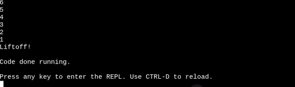

### Wiring

No wiring was necessary for this part

### Code
[Code for the countdown](raspberry-pi/LaunchPad1.py)

### Reflection

To start out I tried using a counter without knowing how the values of interments worked. I had to do some research using the links embedded in the document of the assignment and help from a classmate on some syntax issues such as not adding a colon at the end of a for loop. Also not making my interment # negative, and forgetting parenthesees. 

## LaunchPad2

### Assignment Description

Launch Pad Part 2: The second part to the launch pad combines the use of the countdown from part one and elements of the LED blink assignment. Every second of a the countdown the red led goes off, and upon liftoff the green goes off. 

### Evidence 

### Wiring

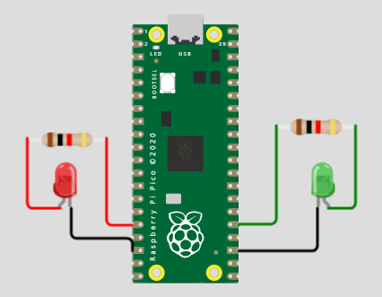

### Code

[Code for Launch pad 2](raspberry-pi/LaunchPad2.py)

### Reflection

I started the task by combining code from the LED blink and the countdown from Launch Pad 1. I figured it would be similar LED code but the difference is what the port I was using is. The final way I figured how to use the red then green leds was to have the green turn on using an "else:" statement only when the counter hit 0. I also had troubles with syntax errors, (capitalization of the word "True", needing to lowercase "value".)

## LaunchPad3

### Assignment Description

Launch Pad Part 3: The third part of the launch pad combines the prior assigmment of the blinking LED with the countdown and adding a button to set off the sequence. 

### Evidence 

### Wiring

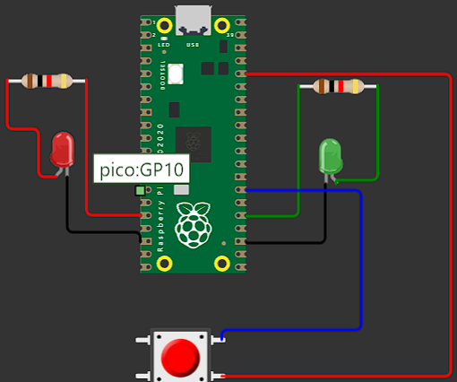

### Code

[Code for Launch pad 3](raspberry-pi/LaunchPad3.py)

### Reflection

This assignment was not as troubling as the previous one. I basically copied the LED code and replaced it with button variables and then added a "while True:" at the top of my main code to trump the rest unless the button is pressed. I also forgot to put the letter "t" in digitalio in one of my lines. The code given in the canvas embedded info was very helpful and basically gave it all to me. 

## LaunchPad4

### Assignment Description

Launch Pad Part 4: The fourth part of the launch pad combines the prior assignment with the button starting the sequence with the addition of a servo turning from 0 degrees to 180 degrees upon liftoff.

### Evidence

### Wiring

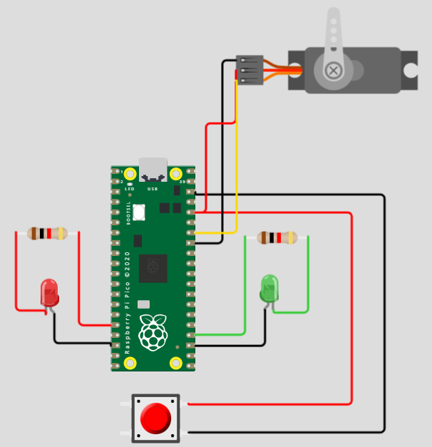

### Code

[Code with the Servo](raspberry-pi/LaunchPad4.py)

### Reflection

This assignment was basically just using the servo code given to me in the module of Launch Pad 4 and trying to implement the servo's features into the code. The biggest problem I had was the allignment of my code not fitting into the "If" statements. You need to have it indented past the "If" statement for it to take effect. 

## CrashAvoidance1

## Raspberry_Pi_Crash_Avoidance

### Assignment Description

First part of crash avoidance. Accelerometer is only part utilized here, gives X/Y/Z values based on the movement of the board.

### Evidence

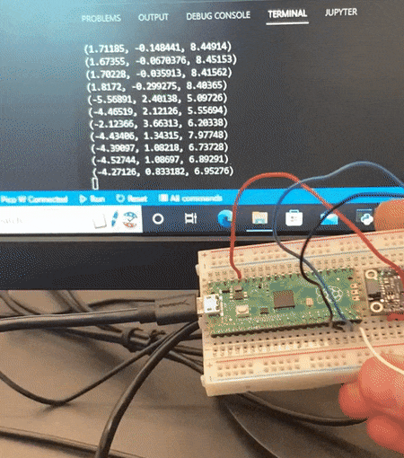

### Wiring

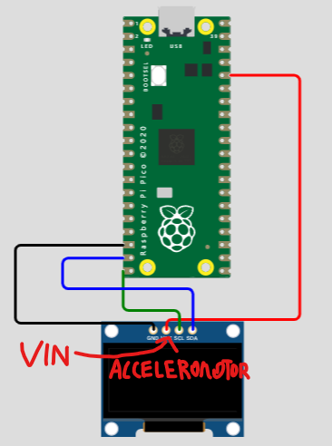

### Code

[Accelerometer Code](raspberry-pi/CrashAvoidance1.py)

### Reflection

Had to remember to put a "time.sleep(1)" at the end of my "while True:" statement. Also had to use "scl", "i2c", and "sda" pins for the first time. Also used the "mpu.acceleration" within the "while True:".

## CrashAvoidance2

### Assignment Description

Second part of crash avoidance. Accelerometer detects when it is at 90 degrees at an X or Y position and turns on an LED.

### Evidence

### Wiring

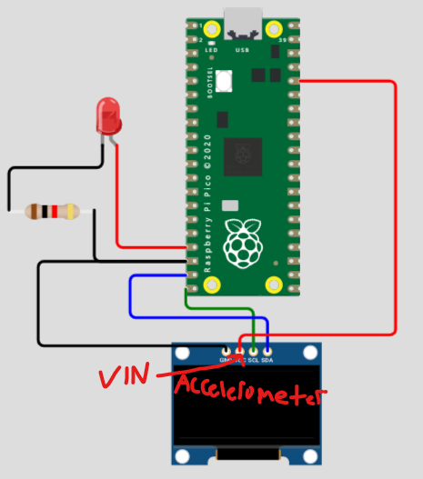

### Code

[Detector Code](raspberry-pi/CrashAvoidance2.py)

### Reflection

Majority of this assignment was adding the led code previously learned into the previous acceleration code. Had issues trying to properly detect the X/Y values because I had the lines determining it stacked on top of each other instead of being in a straight line with only a colon at the end of it. Also had to use "<" and ">" symbols to determine which LED was active. 

## CrashAvoidance3

### Assignment Description

Crash Avoidance part 3. Combines part 2 and adds an OLED screen that displays X/Y/Z values in 3 decimal places as rad/s (radians per second)

### Evidence

### Wiring

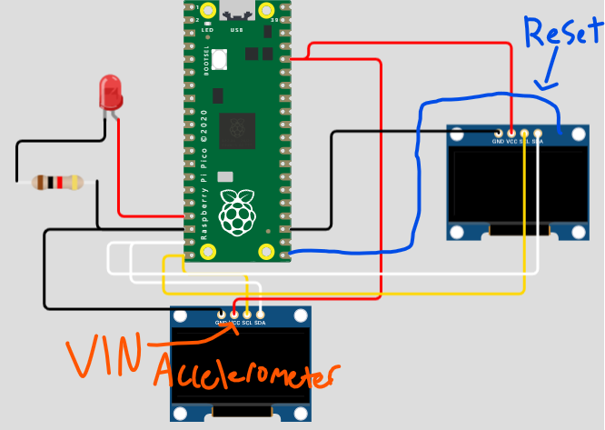

### Code

[OLED Code](raspberry-pi/CrashAvoidance3.py)

### Reflection

One part that simplified wiring was wiring the Pico's GP.. or 3v3 power pins to a whole channel then wiring the accelerometer/OLED to that channel. Used 'f strings' for first time which allows specific code to be printed within its boundaries. Used a 'round' function on either side of the gyro function to determine the decimal places to round to. 

## LandingArea1

### Assignment Description

Landing Area part 1. When inputting 3 sets of x,y coordinates into the terminal the code will give the area of the 3 given vertices, if given a letter input that is not a number it will display an error message and reset the command to prompt a new first coordinate.

### Evidence

### Wiring

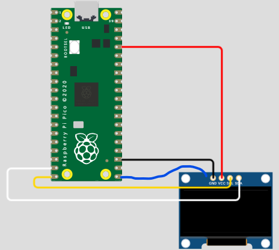

### Code

[Area Code](raspberry-pi/LandingArea1.py)

### Reflection

Had trouble with the "try and except" function because I had left a line of example code in the function. Learned a couple new function such as the try and except and "split" function. Had to use math in the code with the "area_calc" command. 

## LandingArea2

### Assignment Description

Landing Area part 2 takes the area code from Landing Area 1 and displays the triangle created on the OLED.

### Evidence

### Wiring

### Code

[OLED Area Code](raspberry-pi/LandingArea2.py)

### Reflection

Had to use i2c code and splash code for the OLED from Crash avoidance. Had trouble with placement of lines that define functions, needed to have them before the functions themselves. Had to include display bus code as well as "splashes" from prior OLED code. 

## MorseCode1

### Assignment Description

Morse code part 1 takes your input of text and converts it into morse code, if you type "-q" it will cancel the program

### Evidence

### Wiring

No wiring was necessary. 

### Code

[Morse Code](raspberry-pi/MorseCode1.py)

### Reflection

Morse code part 1 gives the translations of the letter to the morse code beforehand, except had to type in my own translation for the space bar. Used a "break" function for the first time which in comination with an "if" statement can break you out of a command, thus the "-q". Then had to transfer the words I put in to morse code with a variable. 

## MorseCode2

### Assignment Description

Morse code part 2 takes the the library of morse code from part one and puts the "dots", "dashes", "slashes", and spaces into the form of a blinking led

### Evidence

### Wiring

### Code

[Code](raspberry-pi/MorseCode2.py)

### Reflection

Started with a short library of variables to replace #s for time.sleep times. Had to establish each of the ". - / and space" for their given time.sleep for the led. For reasons Mr. Miller could not explain printing the "character" variable and not the prior "variable" variable worked in the LED blinking and the morse code written out properly.

## OnshapeBeam

### Assignment Description

Beam designed in onshape with specific hole parameters and a max weight of 13g in PLA. Made to hold up a # of weight from a hanging object at the very end.

### Part Link 
 
[Onshape Link](https://cvilleschools.onshape.com/documents/4862023c791f906fb6af291a/w/f146bbfecf1ea583b0372a0c/e/992fcce4075b3db17b2d1dff?renderMode=0&uiState=6363fb199f09cf7adfb87b42)

### Part Image

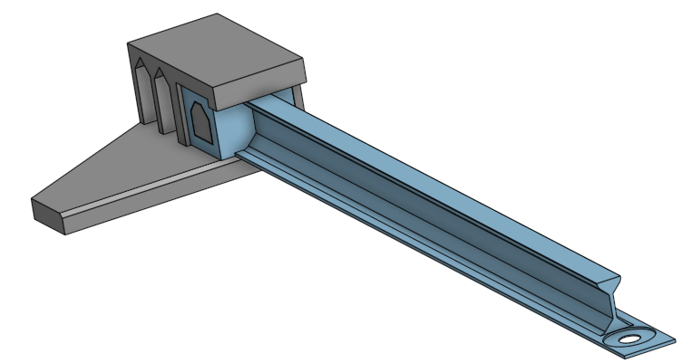

### Reflection

Began this project doing some reasearch on beam theory and strongest beam designs. The "T" or "I" beam are the strongest versions of a simplified beam. I could not have overhang like how an "I" beam is designed, so I created a T beam. Used the most weight in the middle beam as the vertical strength is more important than the horizontal. Also filleted egdes on the vertical to prevent corners and stresss concentrators. 

## SimScale

### Assignment Description

Beam designed in onshape is tested in SimScale. Used 4 total simulations and the 2nd one I did was the best.

### Part Link

[Onshape Link](https://cvilleschools.onshape.com/documents/4862023c791f906fb6af291a/w/f146bbfecf1ea583b0372a0c/e/992fcce4075b3db17b2d1dff?renderMode=0&uiState=6363fb199f09cf7adfb87b42)

### Part Image

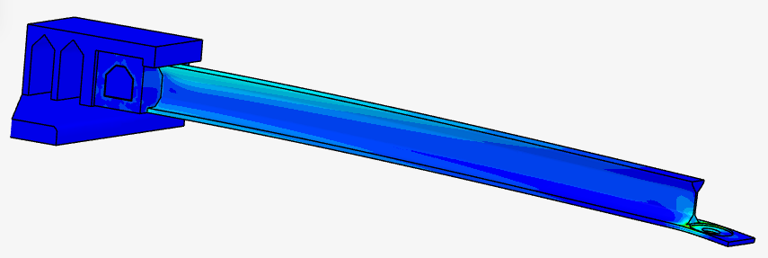

### Reflection

Ran my first simulation and it had a very clear breaking point at the end of the beam. Redesigned multiple times making the bottom beam thicker each time. At the end I realized the 2nd simulation held up the most force, so I decided with that one.

## OnshapeBeamRe-design

### Assignment Description

Re-design of the beam after using simscale.

### Part Link

[Onshape Link](https://cvilleschools.onshape.com/documents/4862023c791f906fb6af291a/w/f146bbfecf1ea583b0372a0c/e/992fcce4075b3db17b2d1dff?renderMode=0&uiState=6363fb199f09cf7adfb87b42)

### Part Image

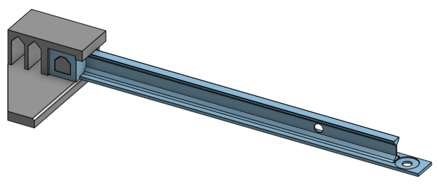

### Reflection

I tried doing various things such as changing the bottom beam height, open holes, and middle beam width. I changed the bottom beam height because otherwise the end piece with the hole supporting weight would snap too easy. I made a hole in the middle beam to lessen the mass, and I thinned the middle beam width also to lessen the mass.

&nbsp;

## Media Test

Your readme will have various images and gifs on it. Upload a test image and test gif to make sure you've got the process figured out. Pick whatever image and gif you want!

### Test Link
[Buy more stickers](https://www.amazon.com/Stickers-Grocery-Warning-Labels-Adhesive/dp/B08SLZMMVW/ref=sr_1_3?keywords=spicy+stickers&qid=1662053762&sr=8-3)

[Test.py](raspberry-pi/test.py)
### Test Image

### Test GIF

